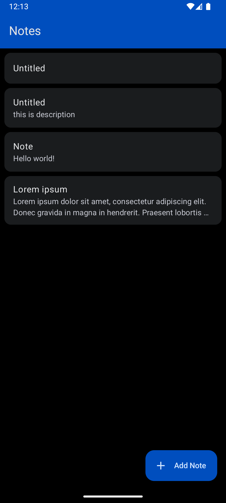
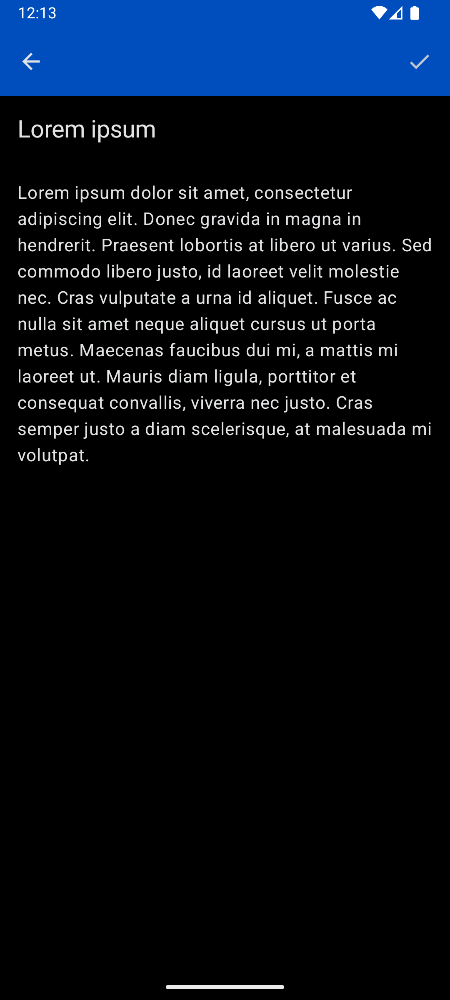

# Simple KMP Note-Taking App
A Kotlin Multiplatform note-taking app that uses Room for local storage and Compose Multiplatform for a shared user interface.

Supported platforms:
- Android
- iOS

## Dependencies
- [Compose Multiplatform](https://www.jetbrains.com/compose-multiplatform/)
- [ViewModel](https://www.jetbrains.com/help/kotlin-multiplatform-dev/compose-viewmodel.html)
- [Room Database](https://developer.android.com/kotlin/multiplatform/room)
- [Navigation Components](https://developer.android.com/guide/navigation)
- [Koin](https://insert-koin.io)

## Screenshots
 
 

